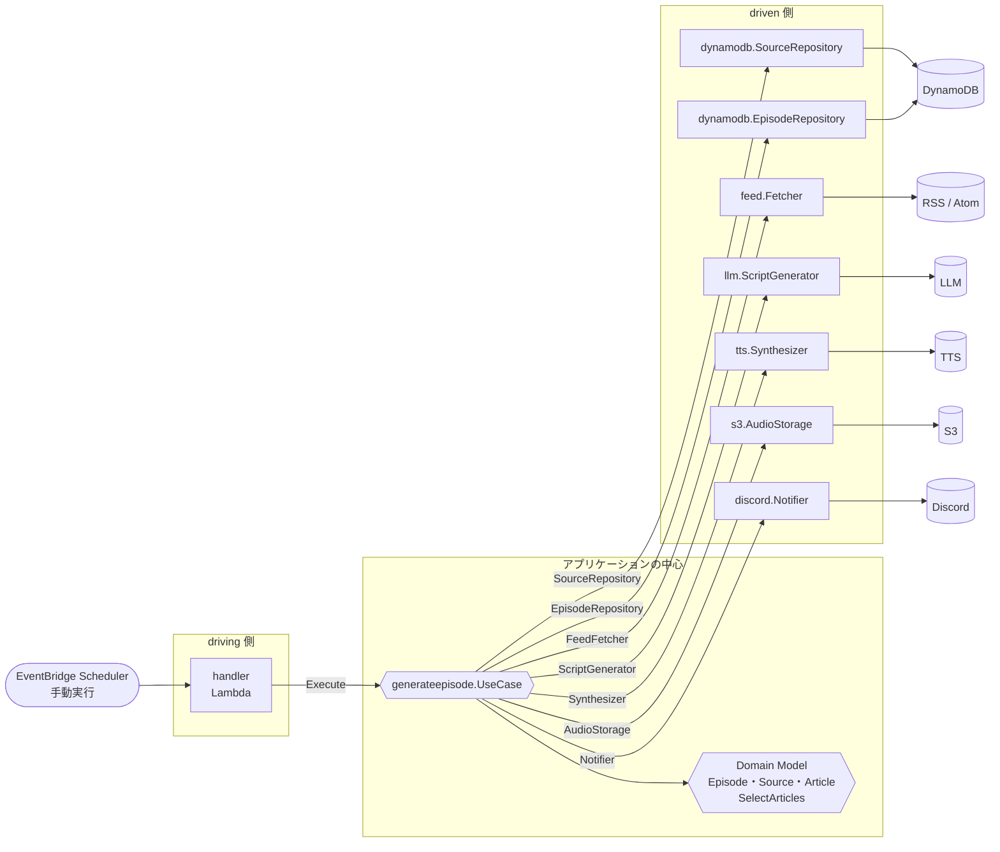
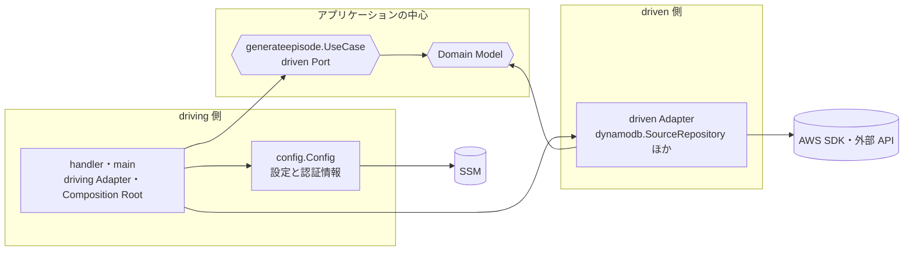

# Architecture — MVP

このファイルは、[Domain Model](domain-model.md) を Go のコードとしてどう構成するかを示す。アーキテクチャの方式（Ports and Adapters）、依存の向き、パッケージ構成、Port と Adapter の配置、横断的な実装方針を扱う。

- 状態: MVP の設計として合意済み（2026-10-05）。2026-10-07 のレビュー（[architecture-review.md](architecture-review.md)、[architecture-rereview.md](architecture-rereview.md)）を受けて A-18〜A-24 を追加し、既存の判断の一部を改めた。この修正は未合意である。まだ決めていない項目は [§11](#11-未決事項) にまとめた
- 前提: MVP の Use Case は GenerateEpisode の1つだけで、Lambda（`provided.al2023`・`arm64`、バイナリ名 `bootstrap`）として動く
- 本文中の A-xx はアーキテクチャの設計判断、D-xx は Domain Model の設計判断を指す。補足は関係する節の直後に置き、一覧は [§12](#12-設計判断の一覧) にまとめた

## 1. 方針

| 方針 | 内容 |
| --- | --- |
| 必要な分だけ層を切る | Use Case が1つしかないことを踏まえ、過度な抽象化は避ける |
| Domain Model と矛盾させない | D-01〜D-18 の判断をそのままコードの構造に写す |
| 外部サービスを内側に持ち込まない | Domain と Usecase は AWS SDK や外部 API の SDK を import しない |
| ローカルでテストできる | Port を fake にすれば Use Case をテストできる。Adapter を差し替えれば Lambda の外でも実行できる |

## 2. 層構成

### Ports and Adapters

全体は Ports and Adapters（ヘキサゴナルアーキテクチャ）で構成する（[A-01](#a-01)）。アプリケーションの中心は外部サービスを知らず、Port を通してだけ外側とやり取りする。外側の Adapter は Port を実装するか、Port を呼び出す。

中心は Domain と Usecase の2つのパッケージに分ける（[A-02](#a-02)）。ヘキサゴナルアーキテクチャは中心の内部の分け方を決めていないので、これは方式からの逸脱ではない。



矢印は呼び出しの向き、矢印のラベルは Port（interface）、driven 側の箱は Port を実装する Adapter の型を表す。型名は [§3](#型名) で定義する。`llm` と `tts` は仮の名前で、実際のパッケージ名は #3 で選ぶサービスの名前になる。

| 用語 | この設計での対応 |
| --- | --- |
| 中心 | Domain Model と `generateepisode.UseCase` |
| driving Port | `UseCase.Execute`。driving Adapter は1つしかないので、interface は定義せずに `UseCase` を直接呼ぶ |
| driving Adapter | Lambda の `handler` |
| driven Port | SourceRepository、EpisodeRepository、FeedFetcher、ScriptGenerator、Synthesizer、AudioStorage、Notifier。Repository も driven Port の一種として扱う |
| driven Adapter | `dynamodb.SourceRepository`、`feed.Fetcher` など、driven Port を実装する型 |

<a id="a-01"></a>

> **A-01: Ports and Adapters（ヘキサゴナルアーキテクチャ）を採用する**
>
> - 検討した案: 層を分けず、handler から SDK や外部 API を直接呼ぶ / オニオンアーキテクチャ / クリーンアーキテクチャ
> - 理由: 外部サービスとの境界に interface を置く理由が、このシステムには3つある。1つ目に、driven Port が7つあり（外部サービスは6つ）、そのうち LLM と TTS はサービスをまだ選んでいない（#3）。差し替えは将来の仮定ではなく、実装の最初に起きる。2つ目に、Use Case には確かめたい分岐が多い（Source が0件、一部の取得の失敗と全件の失敗（D-17）、記事0件（D-16）、New と Replace、`ErrEpisodeConflict`、不正な Reference の除外（D-14））。LLM と TTS は呼ぶたびに課金されるので、本物を呼ぶテストは日常的には回せない。Port を fake にすれば、これらをネットワークなしで決定的にテストできる。3つ目に、Go の interface は暗黙に満たされ、使う側が定義できるので、Port 1つのコストは数行で済む。層を分けない案では2つ目が成り立たない
> - 理由（ほかの方式との比較）: 依存を内側に向けるという原則はどれも同じで、Go で素直に書けばコードはほぼ同じになる。違いは典型の構成にどこまで合わせるかにある。オニオンは Repository の interface を Domain の円に置くのが典型であり、使う側が interface を定義する A-05 と食い違う。クリーンアーキテクチャは Presenter、Input / Output Boundary、境界を越えるときの DTO への詰め替えを典型とするが、結果を返さないバッチではこれらに中身がなく、過度な抽象化になる。ヘキサゴナルは中心と外側の境界だけを決め、中心の内部の分け方を縛らないので、A-02 の構成と両立する
> - 見直す条件: CMS 向けの API など、結果を整形して返す driving Adapter が増え、Presenter に相当する責務が必要になったとき

### 依存の向き



この図の矢印は import の向きを表す。Domain はどこにも依存せず、Usecase は Domain だけに依存する。driven Adapter も Domain だけに依存し、Usecase を import しない。Go の interface は暗黙に満たされるので、Usecase が定義した Port を実装するために Usecase を import する必要はない（[A-19](#a-19)）。Usecase と driven Adapter をつなぐのは `cmd` だけである。呼び出しの向き（前の図）では Usecase が Adapter を呼ぶが、Usecase は Adapter を import せず、自分が定義した Port にだけ依存する。これが driven Port による依存性逆転である。

| 層 | パッケージ | 責務 | import してよいもの |
| --- | --- | --- | --- |
| Domain | `internal/domain` | Entity・Value Object・不変条件・SelectArticles などのドメインのルール。Port で受け渡す値と、Port の契約に含まれるエラー（A-19） | 標準ライブラリ |
| Usecase | `internal/usecase/<name>` | Use Case の手順、driven Port の interface、LLM 出力の検証（D-03） | 標準ライブラリ、Domain、`golang.org/x/sync` |
| driven Adapter | `internal/adapter/<tech>` | driven Port の実装。外部サービスの仕様を閉じ込める | 標準ライブラリ、Domain、外部の SDK。Usecase と他の Adapter は import しない |
| driving Adapter・エントリポイント | `cmd/<name>` | Lambda の handler、設定の読み込み、依存の組み立て | 制限なし |

`internal/config` はエントリポイントの補助であり、`cmd` からだけ使う。

<a id="a-02"></a>

> **A-02: 中心を Domain と Usecase のパッケージに分ける**
>
> - 検討した案: Domain と Usecase を1つのパッケージ（`core` など）にまとめる
> - 理由: SelectArticles や Episode の不変条件は Port を使わない純粋なテストにしたい。一方、Use Case のテストは Port の fake を使う。パッケージを分けると、テストの種類と依存の範囲が一致して分かりやすい
> - 見直す条件: 層を分けたことで、パッケージ間の受け渡しのためだけのコードが目立つようになったとき

<a id="a-03"></a>

> **A-03: 依存の向きは depguard で検査する**
>
> - 検討した案: 設計書に書いて review で守る
> - 理由: golangci-lint の depguard なら数行の設定で、§2 の表の「import してよいもの」を強制できる。「Domain と Usecase は SDK を import しない」「Adapter は Usecase を import しない」を人の注意に頼らずに守れる
> - ルール:
>   - Domain: 標準ライブラリだけ
>   - Usecase: 標準ライブラリ、Domain、`golang.org/x/sync`（並行取得の同時実行数の制限に `errgroup` を使う。[A-12](#a-12)）
>   - driven Adapter: `internal/usecase` と、自分以外の `internal/adapter` を import しない
>   - `cmd`: 制限しない
> - 備考: 設定と CI への組み込みは #3 の実装と一緒に行う（[§11](#11-未決事項)）

## 3. パッケージ構成

```text
cmd/
  generate-episode/
    main.go                 handler と Composition Root
  generate-episode-dev/
    main.go                 ローカル実行用の Composition Root（A-16）
internal/
  domain/                   Source, Article, SelectArticles, Episode, Script, Topic, Reference, Audio, AudioData,
                            EpisodeID, Date, DateOf, ValidateContent, ErrEpisodeConflict
  usecase/
    generateepisode/        Use Case, Port, Repository, Reference の検証
  config/                   環境変数と SSM の読み込み
  adapter/
    dynamodb/               SourceRepository, EpisodeRepository
    s3/                     AudioStorage
    feed/                   FeedFetcher（RSS / Atom）
    discord/                Notifier
    local/                  ローカル実行用の Adapter（A-16）
    <vendor>/               ScriptGenerator, Synthesizer（サービスは #3 で選ぶ。A-06）
docs/
```

Domain・Usecase・Adapter のパッケージ（とその補助の `config`）は `internal/` の下に置き、外部のモジュールから import させない。Lambda のエントリポイント（driving Adapter と Composition Root）は `cmd/` の下に置く。

### 型名

主な型の名前を次のとおりとする。図と本文ではこの名前で呼ぶ。

| パッケージ | 型・関数 | 役割 |
| --- | --- | --- |
| `domain` | `Source`、`Article`、`Episode`、`Script`、`Topic`、`Reference`、`Audio`、`EpisodeID`、`Date` | Domain Model の Entity と Value Object（以下、まとめて Domain Model と呼ぶ） |
| `domain` | `SelectArticles`、`DateOf`、`ValidateContent` | 記事の選定、JST の日付の算出、Script と Topics の不変条件の検査（D-18） |
| `domain` | `AudioData`、`ErrEpisodeConflict` | Port で受け渡す音声データ、Save の一意性違反（A-19） |
| `generateepisode` | `UseCase`（メソッド `Execute`） | GenerateEpisode Use Case |
| `generateepisode` | `Settings` | Use Case の設定値（window、k、N、フィードの同時取得数） |
| `generateepisode` | `SourceRepository`、`EpisodeRepository`、`FeedFetcher`、`ScriptGenerator`、`Synthesizer`、`AudioStorage`、`Notifier` | driven Port（interface） |
| `config` | `Config`、`Load` | 環境変数と SSM から読み込んだ設定 |
| `dynamodb` | `SourceRepository`、`EpisodeRepository` | 同名の Port を実装する driven Adapter |
| `feed` | `Fetcher` | FeedFetcher を実装する driven Adapter |
| `<vendor>` | `ScriptGenerator`、`Synthesizer` | ScriptGenerator・Synthesizer を実装する driven Adapter。LLM と TTS のサービスが異なれば、それぞれのパッケージに分かれる |
| `s3` | `AudioStorage` | AudioStorage を実装する driven Adapter |
| `discord` | `Notifier` | Notifier を実装する driven Adapter |
| `local` | `SourceRepository`、`EpisodeRepository`、`Synthesizer`、`AudioStorage`、`Notifier` | ローカル実行用の driven Adapter（A-16） |
| `main`（`cmd/generate-episode`） | `handler`、`main` | driving Adapter と Composition Root |
| `main`（`cmd/generate-episode-dev`） | `main` | ローカル実行用の driving Adapter と Composition Root |

driven Adapter の型には、実装する Port と同じ名前を付ける。パッケージ名で技術を区別し、利用側では `dynamodb.EpisodeRepository` のように読める。ただし `feed.FeedFetcher` のようにパッケージ名と重なる場合は、重なる部分を省いて `feed.Fetcher` とする。

<a id="a-04"></a>

> **A-04: Domain は1つのパッケージにする**
>
> - 検討した案: Aggregate ごとに `internal/domain/episode`、`internal/domain/source`、`internal/domain/article` に分ける
> - 理由: 型は十数個しかない。分けると `episode.Episode` のような名前の重複と import が増える。Aggregate をまたぐ参照がないこと（[domain-model.md §4](domain-model.md#4-モデル概観)）は、パッケージの境界ではなく設計書と review で守る
> - 見直す条件: Aggregate が増え、Domain のファイルが見通せなくなったとき

### Domain の型の公開範囲

Episode は、フィールドを非公開にして getter で読ませる。生成は `New` だけで行い、永続化から復元するときも `New` を通して不変条件を検査する。`New` と `Replace` は受け取った Topics を各 Topic の References まで含めて複製して保持し、`Topics()` も References まで含めた複製を返す。外から Episode の Topics を書き換えられないようにするためである。Topic は `[]Reference` を持つので、`[]Topic` だけの浅い複製では References の配列を共有したままになる。

Topic、Reference、Audio、Source、Article は自分の不変条件を持たないので、フィールドを公開した struct とする。不変条件は Episode がまとめて検査する。

DynamoDB の属性名などのタグ（`dynamodbav`）は Domain の型に付けない。各 Adapter の中に永続化用の struct を置き、Domain の型との詰め替えもその Adapter の中に書く。Mapper のパッケージは作らない。

<a id="a-23"></a>

> **A-23: Episode のフィールドだけを非公開にし、永続化用の struct は Adapter に置く**
>
> - 検討した案: Episode もフィールドを公開し、コンストラクタを使う約束にする / Topic・Reference・Audio も非公開にする / Domain の型に `dynamodbav` タグを付けてそのまま保存する / 復元専用の関数（`Reconstruct` など）を作る
> - 理由: Episode のフィールドを公開すると、不変条件（Script と Topics が空でない、Audio がある、Replace しても ID と Date は変わらない）を経由しない生成や変更を防げない。一方、Topic・Reference・Audio は自分の不変条件を持たないので、非公開にしても何も検査しないコンストラクタと getter が増えるだけである。Use Case の Reference の照合、LLM・DynamoDB・Discord の Adapter もそれらを通すことになる。守りたいのは「Episode の Topics を外から書き換えられない」ことであり、Episode がコピーして持てば足りる。タグを付けると DynamoDB の属性名が Domain に入る。保存済みのデータは不変条件を満たしているはずなので、復元にも `New` を使えば専用の関数は要らず、壊れたデータにも読み込んだ時点で気付ける
> - 見直す条件: Topic・Reference・Audio に自分の不変条件（URL が絶対 URL であるなど）を足すとき。不変条件を変えたときに、それを満たさない保存済みのデータを読む必要が出たとき

## 4. driven Port

driven Port（Repository を含む）の interface は、それを使う Use Case のパッケージ（`internal/usecase/generateepisode`）に置く。driven Adapter はそのパッケージを import せず、メソッドの形を合わせることで実装する（[A-19](#a-19)）。どの Adapter がどの Port を実装するかは [§2 の図](#ports-and-adapters) のとおりである。

各 Port の操作は次のとおりとする。入力と出力には Domain Model の型を使い、外部サービスの型を出さない。どの操作も `context.Context` を受け取り、失敗したときは error を返す。

| Port | 操作 | 入力 | 出力 | 備考 |
| --- | --- | --- | --- | --- |
| SourceRepository | FindAll | なし | Source の一覧 | 順序は保証しない。重複除去に必要な順序は Use Case が決める（[§7](#7-フィードの取得)） |
| EpisodeRepository | FindByDate | Date | Episode（なければ「なし」） | 見つからないことは error にしない |
| EpisodeRepository | Save | Episode | なし | 同じ Date に ID の異なる Episode があれば `domain.ErrEpisodeConflict`（[A-22](#a-22)） |
| FeedFetcher | Fetch | Source | Article の一覧 | Summary は HTML を除いたプレーンテキスト。N 文字への切り詰めは SelectArticles が行う（D-07） |
| ScriptGenerator | Generate | Article の一覧 | Script と Topic の一覧 | |
| Synthesizer | Synthesize | Script | AudioData | |
| AudioStorage | Put | EpisodeID と AudioData | Audio | 呼び出すたびに新しい Key で保存し、既存の音声を上書きしない（[A-18](#a-18)） |
| Notifier | Notify | Episode | なし | 配信 URL は `cmd` から渡された関数で Audio から作る（[A-24](#a-24)） |

AudioData は、Synthesizer が生成して AudioStorage が保存する音声データであり、音声のバイト列と Content-Type を持つ（[A-07](#a-07)）。特定の Use Case のものではないので、`ErrEpisodeConflict` とともに Domain に置く（[A-19](#a-19)）。操作名などの細部は実装時に変えてよい。

### Episode テーブルのキー

Episode テーブルのパーティションキーは Date（`YYYY-MM-DD`）とし、ソートキーは持たない（[A-22](#a-22)）。

- FindByDate は Date を指定した GetItem で行う
- Save は条件付きの PutItem 1回で行う。条件は「その Date のアイテムがない、または ID が同じ」（`attribute_not_exists(#date) OR id = :id`）とする
- 条件を満たさないときの `ConditionalCheckFailedException` を `domain.ErrEpisodeConflict` に変換する

<a id="a-22"></a>

> **A-22: Episode テーブルのパーティションキーは Date にする**
>
> - 検討した案: ID をパーティションキーにし、Date の一意性は日付ごとのロック用のアイテムと TransactWriteItems で保証する / ID をパーティションキーにし、Date の GSI で検索する
> - 理由: Date の一意性（[episode.md](domain-model/episode.md#identity-と-date)）を、条件付き書き込み1回で原子的に保証できる。FindByDate も GetItem で済む。ID がキーでなくても、Episode の Identity が ID であることは変わらない（D-11）。ID をキーにすると、GSI は結果整合なので一意性の確認に使えず、ロック用のアイテムとトランザクションが必要になる
> - 見直す条件: CMS から ID で Episode を引く必要が出たとき（ID の GSI を足す）

Adapter は技術ごとにパッケージを分ける。DynamoDB の属性との対応（config テーブルの `endpoint` を FeedURL に読み替えるなど）やクライアントの生成を、技術ごとに1か所にまとめるためである。LLM と TTS は #3 で選ぶサービスの名前をパッケージ名にする。LLM と TTS に同じサービスを選んだ場合は、1つのパッケージに ScriptGenerator と Synthesizer を置く。

<a id="a-05"></a>

> **A-05: Repository と Port は Use Case のパッケージに置く**
>
> - 検討した案: Repository は Domain、Port は Usecase に置く / すべて Domain に置く / Usecase 全体で1つのパッケージにして共有する
> - 理由: interface は使う側が定義するという Go の慣習に合わせる。今 interface を使うのは GenerateEpisode だけであり、Repository を Domain に置いても使う側が Domain にいないので得るものがない。2つ目の Use Case が同じ Port を必要とした場合も、それぞれのパッケージで必要なメソッドだけを定義する。Go の interface は暗黙に満たされるので、1つの Adapter が両方を満たせる
> - 備考: Go で構造的に一致するのはメソッドの集合だけである。Port で受け渡す値や、Port の契約に含まれる sentinel error は構造的には一致しないので、Use Case のパッケージには置かない（[A-19](#a-19)）
> - 見直す条件: 複数の Use Case で同じ interface の定義を何度も書くことが負担になったとき

<a id="a-19"></a>

> **A-19: Port で受け渡す値と Port の契約に含まれるエラーは Domain に置き、Adapter は Usecase を import しない**
>
> - 検討した案: Port と同じく Use Case のパッケージに置く / 共有用のパッケージ（`internal/port` など）を作る
> - 理由: Go の interface は暗黙に満たされるので、Adapter が Usecase を import する理由は、Port と同じパッケージに置いた値（AudioData）とエラー（ErrEpisodeConflict）だけである。エラーは値なので、2つ目の Use Case が同じ Adapter を使うと、そのエラーを判定するために1つ目の Use Case のパッケージを import することになり、Use Case どうしが依存する。「Date はユニーク」は Episode のルール（[episode.md](domain-model/episode.md#identity-と-date)）なので、その違反は Domain のエラーとして表すのが自然である。AudioData も特定の Use Case のものではない。共有用のパッケージは、型が2つしかない今は Domain と分ける利点がない
> - 備考: Adapter が Port を満たしているかのコンパイル時の検査（`var _ generateepisode.FeedFetcher = (*Fetcher)(nil)` など）は Adapter に書かない。書くと Usecase への import が戻る。`cmd` で Adapter を Use Case に渡す代入が同じ検査を兼ねる
> - 見直す条件: Port で受け渡すだけの型が増え、Domain の見通しが悪くなったとき

<a id="a-06"></a>

> **A-06: Adapter は技術ごとにパッケージを分ける**
>
> - 検討した案: Port ごとに分ける（`sourcerepo`、`episoderepo` など）
> - 理由: SourceRepository と EpisodeRepository はどちらも DynamoDB を使う。テーブルの属性の扱いやクライアントの生成は、技術ごとにまとめたほうが重複しない
> - 備考: LLM と TTS も、用途（`llm/`・`tts/`）ではなくサービスでパッケージを分ける。同じサービスなら SDK のクライアントと認証情報を共有できる

<a id="a-07"></a>

> **A-07: 音声データは `[]byte` で受け渡す**
>
> - 検討した案: `io.Reader` でストリームとして渡す
> - 理由: 数十分の音声でも数 MB〜数十 MB であり、Lambda のメモリに収まる。Synthesizer が分割して合成した音声の結合や、S3 に渡す Content-Length の計算は `[]byte` のほうが扱いやすい
> - 見直す条件: 音声が長くなり、Lambda のメモリが足りなくなったとき

<a id="a-18"></a>

> **A-18: AudioStorage.Put は上書きせず、呼び出すたびに新しい Key を返す**
>
> - 検討した案: Episode の ID から Key を決めて上書きし、上書きのたびに CloudFront のキャッシュを無効化する
> - 理由: 音声の保存（手順8）は Episode の保存（手順10）より前に行う。上書きする方式では、再生成の Save が失敗したとき（DynamoDB の失敗や `ErrEpisodeConflict`）、保存済みの Episode の Script・Topics と音声が食い違い、通知済みの目次とも一致しなくなる。新しい Key にすれば、Save が成功するまで保存済みの Episode は古い Key を指したままであり、Episode は常に自分が保存した音声だけを指す。Key が変わるので、配信キャッシュの無効化も要らない。Key には Episode の ID と、呼び出しごとに異なる推測困難な要素を含める
> - 備考: 置き換えられた古い音声は削除しない。古い音声が残るのは手動の再生成か Save の失敗のときだけで、量は小さい。Port に削除の操作は足さない
> - 見直す条件: 残った古い音声の量やストレージの費用が問題になったとき

## 5. 依存の組み立て

`cmd/generate-episode/main.go` は driving Adapter（Lambda の handler）であり、Composition Root も兼ねる。DI ライブラリは使わずに手で組み立てる。

```text
main()
  1. config.Load()                設定値を環境変数から、認証情報を SSM から読み込む
  2. AWS SDK の config を読み込む
  3. Adapter を生成する（Notifier には、Audio から配信 URL を作る関数を渡す）
  4. generateepisode.UseCase を生成する（Adapter, Settings, Now, NewID を渡す）
  5. lambda.Start(handler)

handler(ctx)
  usecase.Execute(ctx) を呼び、結果の error をそのまま返す
```

1〜4 は cold start のときに1回だけ実行し、呼び出しのたびには実行しない。handler は Lambda に渡されたイベントを使わない。手動での再実行も、空のペイロードで呼び出す（再生成は D-15 のとおり、実行した日の Episode だけを対象にする）。

<a id="a-08"></a>

> **A-08: 依存は `cmd` で手で組み立てる**
>
> - 検討した案: google/wire などのコード生成による DI / uber/fx などの実行時 DI
> - 理由: 組み立てる Adapter は7つ程度で、手で書いても十分に読める。cold start の初期化（AWS の config、SSM の取得）も `main()` に1回だけ書けば済む
> - 見直す条件: Lambda が増え、各 `cmd` の組み立てコードの重複が目立つようになったとき

### 配信 URL

Audio の Key から配信 URL を作る関数（`func(domain.Audio) string`）は、`cmd` が `AUDIO_BASE_URL` から作り、Notifier の Adapter に渡す。Notifier は配信のベース URL を知らない。

<a id="a-24"></a>

> **A-24: 配信 URL を作る関数は `cmd` で作り、Notifier に渡す**
>
> - 検討した案: Notifier の Adapter が `AUDIO_BASE_URL` を受け取って自分で組み立てる / AudioStorage が Key と一緒に URL も返す
> - 理由: 配信 URL は「どこに保存したか（Key）」と「どこから配信するか（CloudFront のドメイン）」の組み合わせであり、Discord の知識ではない。関数として渡せば、Notifier を差し替えても（ローカル実行の標準出力など）同じ URL を出せる。AudioStorage に URL を返させると Audio が URL を持つことになり、D-12 と食い違う
> - 備考: Key は URL にそのまま使える文字だけで作る（AudioStorage の Adapter の責務）

## 6. 設定値・現在時刻・ID

### 設定値と認証情報

`internal/config` が環境変数と SSM を読み込み、型付きの struct として `cmd` に返す。Usecase と Adapter は読み込み済みの値だけを受け取り、環境変数や SSM を直接読まない。

| 値 | 読み込み元 | 渡す先 | 備考 |
| --- | --- | --- | --- |
| window | 環境変数 | Use Case | 未設定なら 24 時間（D-04） |
| k | 環境変数 | Use Case | デフォルト値は実装時に決める |
| N | 環境変数 | Use Case | SelectArticles が選定後の記事の Summary を N 文字に切り詰める（D-07）。デフォルト値は 300〜500 文字の範囲で実装時に決める |
| フィードの同時取得数 | 環境変数 | Use Case | [§7](#7-フィードの取得) を参照 |
| テーブル名、バケット名、配信のベース URL | 環境変数（infra が設定済み） | 各 Adapter。配信のベース URL は `cmd` が関数にして Notifier に渡す（A-24） | `CONFIG_TABLE_NAME`、`DATA_BUCKET_NAME`、`AUDIO_BASE_URL`。Episode テーブルの名前は infra の変更時に追加する（[infra-alignment.md](domain-model/infra-alignment.md)） |
| LLM・TTS・Discord の認証情報 | SSM（`SECRETS_PARAMETER_PATH` 以下） | 各 Adapter | cold start 時に `GetParametersByPath` で1回だけ取得する |

環境変数の名前は実装時に決め、README に記載する。

<a id="a-09"></a>

> **A-09: 設定値は環境変数、認証情報は cold start 時に SSM から読む**
>
> - 検討した案: 設定値をコードの定数にする / DynamoDB の config テーブルに置いて CMS から変更する / AWS Parameters and Secrets Lambda Extension を使う / 呼び出しのたびに SSM を読む
> - 理由: 環境変数なら、コードを変えずに infra 側で k や N を調整できる。CMS から変更できるようにするのは MVP の範囲を超える。実行は1日1回なので、Extension を足してまでキャッシュする必要はない。cold start 時に読めば、取得の失敗が設定の誤りとして最初に分かる
> - 見直す条件: k や N を CMS から変えたくなったとき

### 現在時刻と ID

Use Case の struct に関数を持たせて注入する。テストでは固定値を返す関数を渡す。

```go
type UseCase struct {
	// ...
	Now   func() time.Time
	NewID func() domain.EpisodeID
}
```

- `cmd` では `Now` に `time.Now` を、`NewID` に UUIDv7 を生成する関数を渡す。UUID のライブラリを import するのは `cmd` だけで、Domain と Usecase は ID の生成方法を知らない
- `EpisodeID` は Domain に置く string ベースの型である

<a id="a-10"></a>

> **A-10: 現在時刻と ID 採番は関数フィールドで注入し、ID は UUIDv7 にする**
>
> - 検討した案: `Clock` と `IDGenerator` の interface を Port として定義する / `Execute(ctx, now)` のように引数で渡す / ID を UUIDv4 や ULID にする
> - 理由: 関数フィールドなら fake の型を書かずに済む。UUIDv7 は時刻順に並ぶので、DynamoDB や CMS で一覧したときに扱いやすい。標準的な UUID の形式なので、外部に公開する識別子としても扱いやすい

### JST の日付

Domain に日付を表す `Date` 型（年・月・日）と、`time.Time` から JST の日付を求める `DateOf(t time.Time) Date` を置く。JST は `time.FixedZone("JST", 9*60*60)` で表す。Use Case は `DateOf(Now())` で `today` を求める。

<a id="a-11"></a>

> **A-11: JST は固定オフセットで表し、Domain に `Date` 型を置く**
>
> - 検討した案: `time/tzdata` をバイナリに埋め込んで `time.LoadLocation("Asia/Tokyo")` を使う / `Date` 型を持たずに `time.Time` の 0 時で表す
> - 理由: `provided.al2023` のイメージに zoneinfo が入っている保証はなく、`LoadLocation` が失敗するおそれがある。日本には夏時間がないので、固定オフセットで正確に扱える。「Episode の Date は JST の日付」というルールを、標準ライブラリだけで Domain に置ける。`time.Time` で日付を表すと、時刻やタイムゾーンの違いで比較を誤りやすい

## 7. フィードの取得

Use Case は Source ごとに goroutine を起動し、フィードを並行に取得する。同時に実行する数には上限を設け、上限は設定値とする（デフォルト値は実装時に決める）。上限は `errgroup` の `SetLimit` で設ける。

- 取得の前に、Source を ID の昇順に並べ替える。SourceRepository は順序を保証しないので（[§4](#4-driven-port)）、SelectArticles の重複除去を決定的にする順序は Use Case が決める
- 結果は Source の順序を保って SelectArticles に渡す。SelectArticles の重複除去は「先に現れた Source の記事を残す」ため、取得が終わった順に並べてはいけない。Source の index を指定してスライスに書き込めば、順序を保てる
- 取得に失敗した Source はスキップしてログに出し、残りの Source で続ける（[D-17](domain-model/generate-episode.md#d-17)）
- Source が0件のとき、またはすべての Source の取得に失敗したときは error にする（D-17）
- フィードの中の個々の記事が壊れている場合（PublishedAt がないなど）は、feed Adapter がその記事を除外して件数をログに出す。Source の取得の失敗としては扱わない

<a id="a-12"></a>

> **A-12: フィードは Source ごとに並行に取得し、順序を保つ**
>
> - 検討した案: Source を1つずつ順に取得する
> - 理由: 取得の時間はほとんどがネットワークの待ちであり、Source が増えるほど順に取得する方式では遅くなる。同時実行数に上限を設ければ、相手のサーバーや Lambda のリソースに過大な負荷をかけない

## 8. エラー・タイムアウト・ロギング

### エラー

| 種類 | 定義する場所 | 扱い |
| --- | --- | --- |
| 不変条件の違反（Script が空など） | Domain の sentinel error（`ErrEmptyScript` など） | `errors.Is` で判定する。Use Case は LLM の出力を受け取った直後に `ValidateContent` で検査し、TTS の前に失敗させる（D-18） |
| Save の一意性違反 | Domain の `ErrEpisodeConflict`（A-19） | DynamoDB Adapter が条件付き書き込みの失敗をこれに変換する（[§4](#episode-テーブルのキー)） |
| 外部サービスの失敗 | 各 Adapter | 一時的な障害は Adapter の中で再試行する（[再試行](#再試行)）。それでも失敗したら、文脈を付けて `fmt.Errorf("...: %w", err)` で包んで返す |

handler は Use Case が返した error をそのまま Lambda に返し、実行の失敗として記録させる。選定後の記事が0件の日（D-16）は error ではなく、nil を返して正常に終了する。

infra は失敗時の自動再試行を無効にしている（`maximum_retry_attempts = 0`）。そのため、error を返しても生成処理全体が自動で再実行されることはない。失敗した実行は手動で再実行する（[generate-episode.md](domain-model/generate-episode.md#失敗時)）。

外部の呼び出し単位では、一時的な障害を Adapter が再試行する（[再試行](#再試行)）。タイムアウトや応答が失われた後の再試行では、相手側で処理済みのリクエストをもう一度送ることがあるので、LLM と TTS の呼び出しが二重に課金されることはありうる。ただし回数には上限がある。

<a id="a-13"></a>

> **A-13: 失敗した実行は handler から error を返す**
>
> - 検討した案: error をログに出すだけにして、nil を返す
> - 理由: error を返せば、CloudWatch の Errors メトリクスに失敗として記録され、気付きやすい。Lambda の再試行は infra 側で無効にしているので、error を返しても生成処理全体が自動でやり直されて課金が重なることはない

### 再試行

一時的な障害の再試行は Adapter の中で行う（[A-20](#a-20)）。Use Case と Port は再試行を知らない。

再試行は1つの層でだけ行う。SDK が再試行を内蔵している場合は、SDK の設定（回数、試行ごとのタイムアウト）で次の表の方針を実現し、Adapter で再試行を重ねない。重ねると試行の回数と所要時間が掛け算で増える。自前で再試行を書くのは、SDK を使わない HTTP の呼び出し（feed、Discord の webhook）だけである。表の回数と条件は初期値であり、実装した後はコードを正とする。

| Adapter | 再試行する条件 | 回数（初回を除く） | 備考 |
| --- | --- | --- | --- |
| LLM | 429、5xx、接続エラー、タイムアウト | 2回 | #3 で選ぶ SDK の設定で実現する。指数バックオフ。429 は `Retry-After` に従う |
| TTS | 同上 | チャンクごとに2回 | #3 で選ぶ SDK の設定で実現する。失敗したチャンクだけをやり直す |
| feed | 5xx、接続エラー、タイムアウト | 1回 | GET は冪等である。それでも失敗した Source は D-17 のとおりスキップする |
| Discord | 429、5xx、接続エラー | 1回 | 429 は `Retry-After` に従う。5xx の後の再試行は二重投稿になりうるが、個人用途なので許容する |
| DynamoDB・S3・SSM | AWS SDK の標準の再試行 | SDK の既定 | 独自の再試行は足さない |

- 試行ごとのタイムアウトは、親の `ctx` の deadline の中に収める。バックオフの待機は `ctx` が終わったら打ち切る
- `ctx` の取り消しや deadline 超過は再試行しない
- 再試行した場合は、回数と理由をログに出す

<a id="a-20"></a>

> **A-20: 一時的な障害は Adapter の中で再試行する**
>
> - 検討した案: 再試行せず、手動で全体を再実行する / Use Case で手順ごとに再試行する / infra で Lambda の再試行を有効にする
> - 理由: 1回の 429 や 5xx でその日の Episode が出なくなるのは、入口としての価値を損なう。手動で再実行すると LLM と TTS を最初からやり直すことになり（D-13）、通知だけが失敗した場合でも番組の内容が変わる。どの応答を一時的な障害とみなすか、`Retry-After` をどう扱うかは外部サービスの仕様なので Adapter の責務であり、Use Case に置くとその知識が内側に漏れる。TTS はチャンク単位でやり直せるので、全体の再実行より安い。Lambda の再試行は全体をやり直すので、二重の課金を避けるために無効のままにする
> - 見直す条件: 再試行を含めた所要時間が Lambda のタイムアウトを圧迫したとき（[A-21](#a-21)）

### タイムアウト

- Use Case と Adapter には、Lambda から受け取った `ctx` をそのまま渡す。Lambda のタイムアウトが、生成処理全体の上限になる
- 外部への呼び出しごとのタイムアウトは、各 Adapter が固定のデフォルト値として持つ（たとえば feed は1件あたり 10 秒）。設定値には出さない
- feed のタイムアウトは必須とする。応答しないフィードが1つあるだけで生成処理全体が Lambda のタイムアウトまで止まり、D-17 のスキップが働かなくなるため

### 実行時間

生成処理は1回の Lambda 実行で完結させる（[A-21](#a-21)）。数十分の音声を作るので、Lambda の上限（15 分）に収める工夫をする。

- Lambda のタイムアウトは上限の 15 分にする（infra の変更）
- Synthesizer は分割したチャンクを並行に合成し、順序を保って結合する。同時実行数は Adapter が固定のデフォルト値として持つ
- 生成全体が上限に収まるかは、#3 でサービスを選ぶときに実測する（[§11](#11-未決事項)）。手順ごとの所要時間はログに出す（[ロギング](#ロギング)）

<a id="a-21"></a>

> **A-21: 生成処理は1回の Lambda 実行で完結させる**
>
> - 検討した案: Step Functions で手順を分け、途中の結果（Script、音声）を保存する
> - 理由: 1回の実行で完結させれば途中の状態を持たずに済み、「Episode は完成したときだけ存在する」（D-13）をそのまま実装できる。手順を分ける構成は Use Case の形と D-13 を変える大きな変更であり、Port と Adapter の分離では局所化できない。そのため、上限に収まるかを実装の最初に確かめる
> - 見直す条件: 実測した所要時間（再試行を含む）が 10 分を超えたとき

### ロギング

`log/slog` の `JSONHandler` を標準出力に出し、`main()` で `slog.SetDefault` する。各所では `slog.InfoContext(ctx, ...)` などを使い、logger は注入しない。

| 出すタイミング | 項目 |
| --- | --- |
| フィードの取得後 | Source ごとの取得件数、取得に失敗した Source とエラー、Adapter が除外した記事の件数 |
| 選定後 | 選定後の記事数。0件で終了した場合はその旨 |
| Reference の検証後 | 除外した Reference の件数と URL（D-14） |
| 保存後 | Episode の ID と Date、新規作成か Replace か |
| 各手順の終了時 | 手順ごとの所要時間 |

<a id="a-14"></a>

> **A-14: ログは slog の JSON で出し、infra の `log_format` は Text のままにする**
>
> - 検討した案: infra の `log_format` を JSON に変える / `TextHandler` を使う / Use Case と Adapter に `*slog.Logger` を注入する
> - 理由: JSON の行は、`log_format` が Text でも CloudWatch Logs Insights がフィールドを自動で抽出する。Use Case は1つなので、logger を注入して出力先を分ける必要はない
> - 見直す条件: Lambda の request_id をログの各行に付けたくなったとき

## 9. テスト方針

| 対象 | 方法 |
| --- | --- |
| Domain | table-driven の単体テスト（SelectArticles、Episode.New / Replace、ValidateContent、DateOf）。`Topics()` で取得した値を References まで書き換えても、Episode の中身が変わらないことも確かめる |
| Use Case | Port と Repository の fake を `_test.go` に手で書いてテストする。mockgen などの生成ツールは使わない。すべての Port に既定の fake を入れた Use Case を返す helper を用意し、各テストでは必要な fake だけを差し替える |
| HTTP を使う Adapter（feed、discord、LLM、TTS） | `httptest.Server` を使う。feed は実際の RSS / Atom の XML を `testdata/` に置く。テキストの分割、メッセージの整形、文字数制限は純粋関数に切り出して単体テストする |
| DynamoDB の Adapter | DynamoDB Local を使った結合テスト。`//go:build integration` を付け、通常の `go test` では実行しない |
| S3 の Adapter | Key の生成を、EpisodeID と乱数の部分を引数で受け取る純粋関数に切り出して単体テストする（A-18 で Key に推測困難な要素を含めるため）。SDK の呼び出しはテストしない |

<a id="a-15"></a>

> **A-15: DynamoDB の Adapter は DynamoDB Local で結合テストし、AWS SDK を fake にしない**
>
> - 検討した案: SDK クライアントのうち使うメソッドだけを interface にし、fake を差し込む / LocalStack を使う / MVP ではテストせず実環境で確かめる
> - 理由: EpisodeRepository でもっとも誤りやすいのは、条件付き書き込みによる Date の一意性（`ErrEpisodeConflict` への変換）とキー設計であり、これは fake では確かめられない。SDK の fake で確かめられるのはリクエストの組み立てだけで、実装をなぞるテストになる。テストのためだけの interface も要らなくなる。S3 は Key の生成を除けば SDK を1回呼ぶだけなので、Key の生成だけをテストする
> - 備考: 結合テストは Docker を必要とするので、build tag で分け、手元と CI で明示的に実行する
> - 見直す条件: DynamoDB Local と実際の DynamoDB の挙動の差が問題になったとき

### ローカル実行

Lambda の外で生成処理を実行する `cmd/generate-episode-dev` を用意する（[A-16](#a-16)）。Use Case と、本物の feed・LLM の Adapter を使い、それ以外は `internal/adapter/local` の Adapter に差し替える。AWS には接続しない。

| Port | ローカル実行での Adapter |
| --- | --- |
| SourceRepository | JSON ファイルから Source を読む |
| FeedFetcher | 本物（`feed`） |
| ScriptGenerator | 本物（LLM のサービスの Adapter） |
| Synthesizer | 既定では無音を返す。フラグを指定すると本物の TTS を使う |
| AudioStorage | ローカルのディレクトリに書く |
| EpisodeRepository | メモリ上に持つ |
| Notifier | 通知内容を標準出力に出す |

LLM や TTS の認証情報は、SSM ではなく環境変数から読む。`internal/adapter/local` は `cmd/generate-episode-dev` だけが import するので、Lambda のバイナリには含まれない。

<a id="a-16"></a>

> **A-16: ローカル実行用の `cmd` を作る**
>
> - 検討した案: 作らず、デプロイした Lambda を手動で実行する / `AWS_LAMBDA_RUNTIME_API` がなければ handler を直接1回呼ぶ
> - 理由: 番組の質はプロンプトの調整で決まり、調整は何度も繰り返す。デプロイした Lambda で試すと、毎回 TTS の料金がかかり、反映にも時間がかかる。Port と Adapter で分けているので、Adapter を差し替えるだけで Use Case をそのまま動かせる。本番の handler に開発用の分岐を入れないために、`cmd` を分ける

## 10. 拡張のしかた

Lambda を1つ足すときは、次の3つを足す。Lambda と Use Case は1対1にし、バイナリは Lambda ごとに分ける。

1. `cmd/<name>/main.go`（driving Adapter と Composition Root）
2. `internal/usecase/<name>`（Use Case と、その Use Case が使う driven Port の interface）
3. 必要な driven Adapter。既存の Adapter は共有し、新しい Use Case の Port を満たすメソッドを既存の Adapter に追加する

CMS の GraphQL は今のところ AppSync のリゾルバで完結しており、backend を経由しない（MVP の範囲外）。backend の処理が必要になったら、AppSync の Lambda データソースを新しい driving Adapter として同じ形で足す。

<a id="a-17"></a>

> **A-17: Lambda と Use Case は1対1にし、バイナリを分ける**
>
> - 検討した案: 複数の Use Case を1つのバイナリに入れ、イベントの内容で振り分ける
> - 理由: Lambda ごとに IAM の権限を最小にできる。振り分けのコードが要らず、各 `cmd` の組み立ても単純になる
> - 見直す条件: Lambda の数が増え、ビルドとデプロイの手間が問題になったとき

## 11. 未決事項

| 項目 | 選択肢・目安 | 決める時期 | 記載箇所 |
| --- | --- | --- | --- |
| depguard の設定と CI への組み込み | golangci-lint の depguard（A-03） | #3 の実装時 | [§2](#2-層構成) |
| LLM と TTS の Adapter のパッケージ名 | 選んだサービスの名前。同じサービスなら1つのパッケージ | #3 でサービスを選んだとき | [§3](#3-パッケージ構成) |
| 生成全体の所要時間 | 15 分に収まるかを実測する。10 分を超えたら A-21 を見直す | #3 でサービスを選んだとき | [§8](#実行時間) |
| 再試行を含めた最悪の所要時間 | LLM と TTS の試行ごとのタイムアウトと再試行の回数（SDK の設定）から見積もり、15 分に収まるように決める | #3 でサービスを選んだとき | [§8](#再試行) |
| LLM の出力上限 | 数十分ぶんの台本の長さに、選んだモデルの出力トークンの上限が足りるかを確かめる | #3 でサービスを選んだとき | [§8](#実行時間) |
| k・N・フィードの同時取得数のデフォルト値と環境変数の名前 | N は 300〜500 文字を目安とする | 実装時 | [§6](#設定値と認証情報) |

Domain Model 側の未決事項は [domain-model.md §7](domain-model.md#7-未決事項) を参照。

## 12. 設計判断の一覧

| ID | 判断 | 記載箇所 |
| --- | --- | --- |
| [A-01](#a-01) | Ports and Adapters（ヘキサゴナルアーキテクチャ）を採用する | §2 |
| [A-02](#a-02) | 中心を Domain と Usecase のパッケージに分ける | §2 |
| [A-03](#a-03) | 依存の向きは depguard で検査する | §2 |
| [A-04](#a-04) | Domain は1つのパッケージにする | §3 |
| [A-05](#a-05) | Repository と Port は Use Case のパッケージに置く | §4 |
| [A-06](#a-06) | Adapter は技術ごとにパッケージを分ける | §4 |
| [A-07](#a-07) | 音声データは `[]byte` で受け渡す | §4 |
| [A-08](#a-08) | 依存は `cmd` で手で組み立てる | §5 |
| [A-09](#a-09) | 設定値は環境変数、認証情報は cold start 時に SSM から読む | §6 |
| [A-10](#a-10) | 現在時刻と ID 採番は関数フィールドで注入し、ID は UUIDv7 にする | §6 |
| [A-11](#a-11) | JST は固定オフセットで表し、Domain に `Date` 型を置く | §6 |
| [A-12](#a-12) | フィードは Source ごとに並行に取得し、順序を保つ | §7 |
| [A-13](#a-13) | 失敗した実行は handler から error を返す | §8 |
| [A-14](#a-14) | ログは slog の JSON で出し、infra の `log_format` は Text のままにする | §8 |
| [A-15](#a-15) | DynamoDB の Adapter は DynamoDB Local で結合テストし、AWS SDK を fake にしない | §9 |
| [A-16](#a-16) | ローカル実行用の `cmd` を作る | §9 |
| [A-17](#a-17) | Lambda と Use Case は1対1にし、バイナリを分ける | §10 |
| [A-18](#a-18) | AudioStorage.Put は上書きせず、呼び出すたびに新しい Key を返す | §4 |
| [A-19](#a-19) | Port で受け渡す値と Port の契約に含まれるエラーは Domain に置き、Adapter は Usecase を import しない | §4 |
| [A-20](#a-20) | 一時的な障害は Adapter の中で再試行する | §8 |
| [A-21](#a-21) | 生成処理は1回の Lambda 実行で完結させる | §8 |
| [A-22](#a-22) | Episode テーブルのパーティションキーは Date にする | §4 |
| [A-23](#a-23) | Episode のフィールドだけを非公開にし、永続化用の struct は Adapter に置く | §3 |
| [A-24](#a-24) | 配信 URL を作る関数は `cmd` で作り、Notifier に渡す | §5 |
