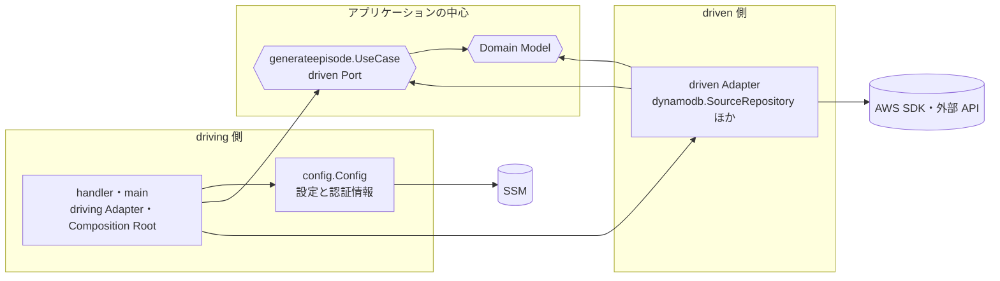

# Architecture — MVP

このファイルは、[Domain Model](domain-model.md) を Go のコードとしてどう構成するかを示す。アーキテクチャの方式（Ports and Adapters）、依存の向き、パッケージ構成、Port と Adapter の配置、横断的な実装方針を扱う。

- 状態: MVP の設計として合意済み（2026-10-05）。まだ決めていない項目は [§11](#11-未決事項) にまとめた
- 前提: MVP の Use Case は GenerateEpisode の1つだけで、Lambda（`provided.al2023`・`arm64`、バイナリ名 `bootstrap`）として動く
- 本文中の A-xx はアーキテクチャの設計判断、D-xx は Domain Model の設計判断を指す。補足は関係する節の直後に置き、一覧は [§12](#12-設計判断の一覧) にまとめた

## 1. 方針

| 方針 | 内容 |
| --- | --- |
| 必要な分だけ層を切る | Use Case が1つしかないことを踏まえ、過度な抽象化は避ける |
| Domain Model と矛盾させない | D-01〜D-17 の判断をそのままコードの構造に写す |
| 外部サービスを内側に持ち込まない | Domain と Usecase は AWS SDK や外部 API の SDK を import しない |
| ローカルでテストできる | Port を fake にすれば Use Case をテストできる |

## 2. 層構成

### Ports and Adapters

全体は Ports and Adapters（ヘキサゴナルアーキテクチャ）で構成する（[A-01](#a-01)）。アプリケーションの中心は外部サービスを知らず、Port を通してだけ外側とやり取りする。外側の Adapter は Port を実装するか、Port を呼び出す。

中心は Domain と Usecase の2つのパッケージに分ける（[A-02](#a-02)）。ヘキサゴナルアーキテクチャは中心の内部の分け方を決めていないので、これは方式からの逸脱ではない。


矢印は呼び出しの向き、矢印のラベルは Port（interface）、driven 側の箱は Port を実装する Adapter の型を表す。型名は [§3](#型名) で定義する。`llm` と `tts` は仮の名前で、実際のパッケージ名は #3 で選ぶサービスの名前になる。

| 用語 | この設計での対応 |
| --- | --- |
| 中心 | Domain Model と `generateepisode.UseCase` |
| driving Port | `UseCase.Execute`。driving Adapter は1つしかないので、interface は定義せずに `UseCase` を直接呼ぶ |
| driving Adapter | Lambda の `handler` |
| driven Port | SourceRepository、EpisodeRepository、FeedFetcher、ScriptGenerator、Synthesizer、AudioStorage、Notifier。Repository も driven Port の一種として扱う |
| driven Adapter | `dynamodb.SourceRepository`、`feed.Fetcher` など、driven Port を実装する型 |

<a id="a-01"></a>

> **A-01: Ports and Adapters（ヘキサゴナルアーキテクチャ）を採用する**
>
> - 検討した案: オニオンアーキテクチャ / クリーンアーキテクチャ
> - 理由: 依存を内側に向けるという原則はどれも同じで、違いは典型の構成にどこまで合わせるかにある。Domain Model の段階から Port と Adapter という用語を使っており、そのまま当てはめられる。オニオンは Repository の interface を Domain の円に置くのが典型であり、使う側が interface を定義する A-05 と食い違う。クリーンアーキテクチャは Presenter、Input / Output Boundary、境界を越えるときの DTO への詰め替えを典型とするが、結果を返さないバッチではこれらに中身がなく、過度な抽象化になる。ヘキサゴナルは中心と外側の境界だけを決め、中心の内部の分け方を縛らないので、A-02 の構成と両立する
> - 見直す条件: CMS 向けの API など、結果を整形して返す driving Adapter が増え、Presenter に相当する責務が必要になったとき

### 依存の向き



この図の矢印は import の向きを表す。Domain はどこにも依存せず、Usecase は Domain だけに依存する。driven Adapter は Usecase が定義した Port を実装するため、Usecase を import する。呼び出しの向き（前の図）と import の向きが逆になるのが、driven Port による依存性逆転である。

| 層 | パッケージ | 責務 | import してよいもの |
| --- | --- | --- | --- |
| Domain | `internal/domain` | Entity・Value Object・不変条件・SelectArticles などのドメインのルール | 標準ライブラリ |
| Usecase | `internal/usecase/<name>` | Use Case の手順、driven Port の interface、LLM 出力の検証（D-03） | 標準ライブラリ、Domain |
| driven Adapter | `internal/adapter/<tech>` | driven Port の実装。外部サービスの仕様を閉じ込める | 制限なし |
| driving Adapter・エントリポイント | `cmd/<name>` | Lambda の handler、設定の読み込み、依存の組み立て | 制限なし |

`internal/config` はエントリポイントの補助であり、`cmd` からだけ使う。

<a id="a-02"></a>

> **A-02: 中心を Domain と Usecase のパッケージに分ける**
>
> - 検討した案: Domain と Usecase を1つのパッケージ（`core` など）にまとめる
> - 理由: SelectArticles や Episode の不変条件は Port を使わない純粋なテストにしたい。一方、Use Case のテストは Port の fake を使う。パッケージを分けると、テストの種類と依存の範囲が一致して分かりやすい
> - 見直す条件: 層を分けたことで、パッケージ間の受け渡しのためだけのコードが目立つようになったとき

<a id="a-03"></a>

> **A-03: 依存の向きは depguard で検査する**
>
> - 検討した案: 設計書に書いて review で守る
> - 理由: golangci-lint の depguard なら数行の設定で、Domain は標準ライブラリだけ、Usecase は標準ライブラリと Domain だけを import できるように制限できる。「Domain と Usecase は SDK を import しない」を人の注意に頼らずに守れる
> - 備考: 設定と CI への組み込みは #3 の実装と一緒に行う（[§11](#11-未決事項)）

## 3. パッケージ構成

```text
cmd/
  generate-episode/
    main.go                 handler と Composition Root
internal/
  domain/                   Source, Article, SelectArticles, Episode, Topic, Reference, Audio, EpisodeID, Date
  usecase/
    generateepisode/        Use Case, Port, Repository, AudioData, ErrEpisodeConflict, Reference の検証
  config/                   環境変数と SSM の読み込み
  adapter/
    dynamodb/               SourceRepository, EpisodeRepository
    s3/                     AudioStorage
    feed/                   FeedFetcher（RSS / Atom）
    discord/                Notifier
    llm/<vendor>/           ScriptGenerator（サービスは #3 で選ぶ）
    tts/<vendor>/           Synthesizer（サービスは #3 で選ぶ）
docs/
```

Domain・Usecase・Adapter のパッケージ（とその補助の `config`）は `internal/` の下に置き、外部のモジュールから import させない。Lambda のエントリポイント（driving Adapter と Composition Root）は `cmd/` の下に置く。

### 型名

主な型の名前を次のとおりとする。図と本文ではこの名前で呼ぶ。

| パッケージ | 型・関数 | 役割 |
| --- | --- | --- |
| `domain` | `Source`、`Article`、`Episode`、`Script`、`Topic`、`Reference`、`Audio`、`EpisodeID`、`Date` | Domain Model の Entity と Value Object（以下、まとめて Domain Model と呼ぶ） |
| `domain` | `SelectArticles`、`DateOf` | 記事の選定、JST の日付の算出 |
| `generateepisode` | `UseCase`（メソッド `Execute`） | GenerateEpisode Use Case |
| `generateepisode` | `Settings` | Use Case の設定値（window、k、フィードの同時取得数） |
| `generateepisode` | `SourceRepository`、`EpisodeRepository`、`FeedFetcher`、`ScriptGenerator`、`Synthesizer`、`AudioStorage`、`Notifier` | driven Port（interface） |
| `generateepisode` | `AudioData`、`ErrEpisodeConflict` | Port で受け渡す音声データ、Save の一意性違反 |
| `config` | `Config`、`Load` | 環境変数と SSM から読み込んだ設定 |
| `dynamodb` | `SourceRepository`、`EpisodeRepository` | 同名の Port を実装する driven Adapter |
| `feed` | `Fetcher` | FeedFetcher を実装する driven Adapter |
| `<vendor>`（`llm/` 以下） | `ScriptGenerator` | ScriptGenerator を実装する driven Adapter |
| `<vendor>`（`tts/` 以下） | `Synthesizer` | Synthesizer を実装する driven Adapter |
| `s3` | `AudioStorage` | AudioStorage を実装する driven Adapter |
| `discord` | `Notifier` | Notifier を実装する driven Adapter |
| `main`（`cmd/generate-episode`） | `handler`、`main` | driving Adapter と Composition Root |

driven Adapter の型には、実装する Port と同じ名前を付ける。パッケージ名で技術を区別し、利用側では `dynamodb.EpisodeRepository` のように読める。ただし `feed.FeedFetcher` のようにパッケージ名と重なる場合は、重なる部分を省いて `feed.Fetcher` とする。

<a id="a-04"></a>

> **A-04: Domain は1つのパッケージにする**
>
> - 検討した案: Aggregate ごとに `internal/domain/episode`、`internal/domain/source`、`internal/domain/article` に分ける
> - 理由: 型は十数個しかない。分けると `episode.Episode` のような名前の重複と import が増える。Aggregate をまたぐ参照がないこと（[domain-model.md §4](domain-model.md#4-モデル概観)）は、パッケージの境界ではなく設計書と review で守る
> - 見直す条件: Aggregate が増え、Domain のファイルが見通せなくなったとき

## 4. driven Port

driven Port（Repository を含む）の interface は、それを使う Use Case のパッケージ（`internal/usecase/generateepisode`）に置く。driven Adapter はそのパッケージを import して実装する。どの Adapter がどの Port を実装するかは [§2 の図](#ports-and-adapters) のとおりである。

各 Port の操作は次のとおりとする。入力と出力には Domain Model の型を使い、外部サービスの型を出さない。どの操作も `context.Context` を受け取り、失敗したときは error を返す。

| Port | 操作 | 入力 | 出力 | 備考 |
| --- | --- | --- | --- | --- |
| SourceRepository | FindAll | なし | Source の一覧 | ID の昇順で返す。[§7](#7-フィードの取得) の重複除去は Source の順序に依存するため、順序を決定的にする |
| EpisodeRepository | FindByDate | Date | Episode（なければ「なし」） | 見つからないことは error にしない |
| EpisodeRepository | Save | Episode | なし | 同じ Date に ID の異なる Episode があれば `ErrEpisodeConflict` |
| FeedFetcher | Fetch | Source | Article の一覧 | |
| ScriptGenerator | Generate | Article の一覧 | Script と Topic の一覧 | |
| Synthesizer | Synthesize | Script | AudioData | |
| AudioStorage | Put | EpisodeID と AudioData | Audio | |
| Notifier | Notify | Episode | なし | |

AudioData は、Synthesizer が生成して AudioStorage が保存する音声データであり、音声のバイト列と Content-Type を持つ（[A-07](#a-07)）。操作名などの細部は実装時に変えてよい。

Adapter は技術ごとにパッケージを分ける。DynamoDB の属性との対応（config テーブルの `endpoint` を FeedURL に読み替えるなど）やクライアントの生成を、技術ごとに1か所にまとめるためである。LLM と TTS は #3 で選ぶサービスの名前をサブパッケージ名にする。

<a id="a-05"></a>

> **A-05: Repository と Port は Use Case のパッケージに置く**
>
> - 検討した案: Repository は Domain、Port は Usecase に置く / すべて Domain に置く / Usecase 全体で1つのパッケージにして共有する
> - 理由: interface は使う側が定義するという Go の慣習に合わせる。今 interface を使うのは GenerateEpisode だけであり、Repository を Domain に置いても使う側が Domain にいないので得るものがない。2つ目の Use Case が同じ Port を必要とした場合も、それぞれのパッケージで必要なメソッドだけを定義する。Go の interface は暗黙に満たされるので、1つの Adapter が両方を満たせる
> - 見直す条件: 複数の Use Case で同じ interface の定義を何度も書くことが負担になったとき

<a id="a-06"></a>

> **A-06: Adapter は技術ごとにパッケージを分ける**
>
> - 検討した案: Port ごとに分ける（`sourcerepo`、`episoderepo` など）
> - 理由: SourceRepository と EpisodeRepository はどちらも DynamoDB を使う。テーブルの属性の扱いやクライアントの生成は、技術ごとにまとめたほうが重複しない

<a id="a-07"></a>

> **A-07: 音声データは `[]byte` で受け渡す**
>
> - 検討した案: `io.Reader` でストリームとして渡す
> - 理由: 数十分の音声でも数 MB〜数十 MB であり、Lambda のメモリに収まる。Synthesizer が分割して合成した音声の結合や、S3 に渡す Content-Length の計算は `[]byte` のほうが扱いやすい
> - 見直す条件: 音声が長くなり、Lambda のメモリが足りなくなったとき

## 5. 依存の組み立て

`cmd/generate-episode/main.go` は driving Adapter（Lambda の handler）であり、Composition Root も兼ねる。DI ライブラリは使わずに手で組み立てる。

```text
main()
  1. config.Load()                設定値を環境変数から、認証情報を SSM から読み込む
  2. AWS SDK の config を読み込む
  3. Adapter を生成する
  4. generateepisode.UseCase を生成する（Adapter, Settings, Now, NewID を渡す）
  5. lambda.Start(handler)

handler(ctx)
  usecase.Execute(ctx) を呼び、結果の error をそのまま返す
```

1〜4 は cold start のときに1回だけ実行し、呼び出しのたびには実行しない。handler は Lambda に渡されたイベントを使わない。手動での再実行も、空のペイロードで呼び出す（再生成は D-15 のとおり、実行した日の Episode だけを対象にする）。

<a id="a-08"></a>

> **A-08: 依存は `cmd` で手で組み立てる**
>
> - 検討した案: google/wire などのコード生成による DI / uber/fx などの実行時 DI
> - 理由: 組み立てる Adapter は7つ程度で、手で書いても十分に読める。cold start の初期化（AWS の config、SSM の取得）も `main()` に1回だけ書けば済む
> - 見直す条件: Lambda が増え、各 `cmd` の組み立てコードの重複が目立つようになったとき

## 6. 設定値・現在時刻・ID

### 設定値と認証情報

`internal/config` が環境変数と SSM を読み込み、型付きの struct として `cmd` に返す。Usecase と Adapter は読み込み済みの値だけを受け取り、環境変数や SSM を直接読まない。

| 値 | 読み込み元 | 渡す先 | 備考 |
| --- | --- | --- | --- |
| window | 環境変数 | Use Case | 未設定なら 24 時間（D-04） |
| k | 環境変数 | Use Case | デフォルト値は実装時に決める |
| N | 環境変数 | feed Adapter | Summary の切り詰めは FeedFetcher の責務。デフォルト値は 300〜500 文字の範囲で実装時に決める |
| フィードの同時取得数 | 環境変数 | Use Case | [§7](#7-フィードの取得) を参照 |
| テーブル名、バケット名、配信のベース URL | 環境変数（infra が設定済み） | 各 Adapter | `CONFIG_TABLE_NAME`、`DATA_BUCKET_NAME`、`AUDIO_BASE_URL`。Episode テーブルの名前は infra の変更時に追加する（[infra-alignment.md](domain-model/infra-alignment.md)） |
| LLM・TTS・Discord の認証情報 | SSM（`SECRETS_PARAMETER_PATH` 以下） | 各 Adapter | cold start 時に `GetParametersByPath` で1回だけ取得する |

環境変数の名前は実装時に決め、README に記載する。

<a id="a-09"></a>

> **A-09: 設定値は環境変数、認証情報は cold start 時に SSM から読む**
>
> - 検討した案: 設定値をコードの定数にする / DynamoDB の config テーブルに置いて CMS から変更する / AWS Parameters and Secrets Lambda Extension を使う / 呼び出しのたびに SSM を読む
> - 理由: 環境変数なら、コードを変えずに infra 側で k や N を調整できる。CMS から変更できるようにするのは MVP の範囲を超える。実行は1日1回なので、Extension を足してまでキャッシュする必要はない。cold start 時に読めば、取得の失敗が設定の誤りとして最初に分かる
> - 見直す条件: k や N を CMS から変えたくなったとき

### 現在時刻と ID

Use Case の struct に関数を持たせて注入する。テストでは固定値を返す関数を渡す。

```go
type UseCase struct {
	// ...
	Now   func() time.Time
	NewID func() domain.EpisodeID
}
```

- `cmd` では `Now` に `time.Now` を、`NewID` に UUIDv7 を生成する関数を渡す。UUID のライブラリを import するのは `cmd` だけで、Domain と Usecase は ID の生成方法を知らない
- `EpisodeID` は Domain に置く string ベースの型である

<a id="a-10"></a>

> **A-10: 現在時刻と ID 採番は関数フィールドで注入し、ID は UUIDv7 にする**
>
> - 検討した案: `Clock` と `IDGenerator` の interface を Port として定義する / `Execute(ctx, now)` のように引数で渡す / ID を UUIDv4 や ULID にする
> - 理由: 関数フィールドなら fake の型を書かずに済む。UUIDv7 は時刻順に並ぶので、DynamoDB や CMS で一覧したときに扱いやすい。標準的な UUID の形式なので、外部に公開する識別子としても扱いやすい

### JST の日付

Domain に日付を表す `Date` 型（年・月・日）と、`time.Time` から JST の日付を求める `DateOf(t time.Time) Date` を置く。JST は `time.FixedZone("JST", 9*60*60)` で表す。Use Case は `DateOf(Now())` で `today` を求める。

<a id="a-11"></a>

> **A-11: JST は固定オフセットで表し、Domain に `Date` 型を置く**
>
> - 検討した案: `time/tzdata` をバイナリに埋め込んで `time.LoadLocation("Asia/Tokyo")` を使う / `Date` 型を持たずに `time.Time` の 0 時で表す
> - 理由: `provided.al2023` のイメージに zoneinfo が入っている保証はなく、`LoadLocation` が失敗するおそれがある。日本には夏時間がないので、固定オフセットで正確に扱える。「Episode の Date は JST の日付」というルールを、標準ライブラリだけで Domain に置ける。`time.Time` で日付を表すと、時刻やタイムゾーンの違いで比較を誤りやすい

## 7. フィードの取得

Use Case は Source ごとに goroutine を起動し、フィードを並行に取得する。同時に実行する数には上限を設け、上限は設定値とする（デフォルト値は実装時に決める）。

- 結果は Source の順序を保って SelectArticles に渡す。SelectArticles の重複除去は「先に現れた Source の記事を残す」ため、取得が終わった順に並べてはいけない。Source の index を指定してスライスに書き込めば、順序を保てる
- 取得に失敗した Source はスキップしてログに出し、残りの Source で続ける（[D-17](domain-model/generate-episode.md#d-17)）
- Source が0件のとき、またはすべての Source の取得に失敗したときは error にする（D-17）
- フィードの中の個々の記事が壊れている場合（PublishedAt がないなど）は、feed Adapter がその記事を除外して件数をログに出す。Source の取得の失敗としては扱わない

<a id="a-12"></a>

> **A-12: フィードは Source ごとに並行に取得し、順序を保つ**
>
> - 検討した案: Source を1つずつ順に取得する
> - 理由: 取得の時間はほとんどがネットワークの待ちであり、Source が増えるほど順に取得する方式では遅くなる。同時実行数に上限を設ければ、相手のサーバーや Lambda のリソースに過大な負荷をかけない

## 8. エラー・タイムアウト・ロギング

### エラー

| 種類 | 定義する場所 | 扱い |
| --- | --- | --- |
| 不変条件の違反（Script が空など） | Domain の sentinel error（`ErrEmptyScript` など） | `errors.Is` で判定する |
| Save の一意性違反 | Usecase の `ErrEpisodeConflict` | DynamoDB Adapter が条件付き書き込みの失敗をこれに変換する |
| 外部サービスの失敗 | 各 Adapter | 文脈を付けて `fmt.Errorf("...: %w", err)` で包んで返す |

handler は Use Case が返した error をそのまま Lambda に返し、実行の失敗として記録させる。選定後の記事が0件の日（D-16）は error ではなく、nil を返して正常に終了する。

infra は失敗時の自動再試行を無効にしている（`maximum_retry_attempts = 0`）。そのため error を返しても LLM や TTS の API を二重に呼ぶことはない。失敗した実行は手動で再実行する（[generate-episode.md](domain-model/generate-episode.md#失敗時)）。

<a id="a-13"></a>

> **A-13: 失敗した実行は handler から error を返す**
>
> - 検討した案: error をログに出すだけにして、nil を返す
> - 理由: error を返せば、CloudWatch の Errors メトリクスに失敗として記録され、気付きやすい。再試行は infra 側で無効にしているので、課金が二重になる心配はない

### タイムアウト

- Use Case と Adapter には、Lambda から受け取った `ctx` をそのまま渡す。Lambda のタイムアウトが、生成処理全体の上限になる
- 外部への呼び出しごとのタイムアウトは、各 Adapter が固定のデフォルト値として持つ（たとえば feed は1件あたり 10 秒）。設定値には出さない
- feed のタイムアウトは必須とする。応答しないフィードが1つあるだけで生成処理全体が Lambda のタイムアウトまで止まり、D-17 のスキップが働かなくなるため

### ロギング

`log/slog` の `JSONHandler` を標準出力に出し、`main()` で `slog.SetDefault` する。各所では `slog.InfoContext(ctx, ...)` などを使い、logger は注入しない。

| 出すタイミング | 項目 |
| --- | --- |
| フィードの取得後 | Source ごとの取得件数、取得に失敗した Source とエラー、Adapter が除外した記事の件数 |
| 選定後 | 選定後の記事数。0件で終了した場合はその旨 |
| Reference の検証後 | 除外した Reference の件数と URL（D-14） |
| 保存後 | Episode の ID と Date、新規作成か Replace か |
| 各手順の終了時 | 手順ごとの所要時間 |

<a id="a-14"></a>

> **A-14: ログは slog の JSON で出し、infra の `log_format` は Text のままにする**
>
> - 検討した案: infra の `log_format` を JSON に変える / `TextHandler` を使う / Use Case と Adapter に `*slog.Logger` を注入する
> - 理由: JSON の行は、`log_format` が Text でも CloudWatch Logs Insights がフィールドを自動で抽出する。Use Case は1つなので、logger を注入して出力先を分ける必要はない
> - 見直す条件: Lambda の request_id をログの各行に付けたくなったとき

## 9. テスト方針

| 対象 | 方法 |
| --- | --- |
| Domain | table-driven の単体テスト（SelectArticles、Episode.New / Replace、DateOf） |
| Use Case | Port と Repository の fake を `_test.go` に手で書いてテストする。mockgen などの生成ツールは使わない |
| HTTP を使う Adapter（feed、discord、LLM、TTS） | `httptest.Server` を使う。feed は実際の RSS / Atom の XML を `testdata/` に置く |
| AWS の Adapter（DynamoDB、S3） | SDK のクライアントのうち使うメソッドだけを interface にし、fake を差し込む |

DynamoDB の条件付き書き込みを `ErrEpisodeConflict` に変換する処理は、fake では本当の挙動を確かめられない。DynamoDB Local などを使った結合テストは未決とする（[§11](#11-未決事項)）。

Lambda の外で生成処理を実行する仕組み（ローカル実行用のモードや `cmd`）は MVP では作らない。実際の LLM や TTS を試すときは、デプロイした Lambda を手動で実行する。

<a id="a-15"></a>

> **A-15: AWS の Adapter は SDK クライアントの最小の interface を fake にしてテストする**
>
> - 検討した案: DynamoDB Local や LocalStack を使った結合テスト / MVP ではテストせず実環境で確かめる
> - 理由: リクエストの組み立てとレスポンスの変換は fake で十分に確かめられ、テストに Docker を必要としない。条件付き書き込みのように AWS 側の挙動に依存する部分だけが残るので、それは結合テストの導入を検討するときに扱う
> - 見直す条件: 条件付き書き込みやキー設計の誤りが fake のテストをすり抜けたとき

<a id="a-16"></a>

> **A-16: ローカル実行の仕組みは作らない**
>
> - 検討した案: `AWS_LAMBDA_RUNTIME_API` がなければ handler を直接1回呼ぶ / 開発用に別の `cmd` を作り、Notifier を標準出力に差し替える
> - 理由: Use Case と Adapter はテストで確かめられる。実際の LLM と TTS を組み合わせた確認は、デプロイした Lambda の手動実行で足りる
> - 見直す条件: プロンプトの調整などで、実際の LLM と TTS を何度も試したくなったとき

## 10. 拡張のしかた

Lambda を1つ足すときは、次の3つを足す。Lambda と Use Case は1対1にし、バイナリは Lambda ごとに分ける。

1. `cmd/<name>/main.go`（driving Adapter と Composition Root）
2. `internal/usecase/<name>`（Use Case と、その Use Case が使う driven Port の interface）
3. 必要な driven Adapter。既存の Adapter は共有し、新しい Use Case の Port を満たすメソッドを既存の Adapter に追加する

CMS の GraphQL は今のところ AppSync のリゾルバで完結しており、backend を経由しない（MVP の範囲外）。backend の処理が必要になったら、AppSync の Lambda データソースを新しい driving Adapter として同じ形で足す。

<a id="a-17"></a>

> **A-17: Lambda と Use Case は1対1にし、バイナリを分ける**
>
> - 検討した案: 複数の Use Case を1つのバイナリに入れ、イベントの内容で振り分ける
> - 理由: Lambda ごとに IAM の権限を最小にできる。振り分けのコードが要らず、各 `cmd` の組み立ても単純になる
> - 見直す条件: Lambda の数が増え、ビルドとデプロイの手間が問題になったとき

## 11. 未決事項

| 項目 | 選択肢・目安 | 決める時期 | 記載箇所 |
| --- | --- | --- | --- |
| depguard の設定と CI への組み込み | golangci-lint の depguard（A-03） | #3 の実装時 | [§2](#2-層構成) |
| DynamoDB の結合テスト | DynamoDB Local / LocalStack / 導入しない | EpisodeRepository の実装時 | [§9](#9-テスト方針) |
| LLM と TTS の Adapter のパッケージ名 | 選んだサービスの名前 | #3 でサービスを選んだとき | [§3](#3-パッケージ構成) |
| k・N・フィードの同時取得数のデフォルト値と環境変数の名前 | N は 300〜500 文字を目安とする | 実装時 | [§6](#設定値と認証情報) |

Domain Model 側の未決事項は [domain-model.md §7](domain-model.md#7-未決事項) を参照。

## 12. 設計判断の一覧

| ID | 判断 | 記載箇所 |
| --- | --- | --- |
| [A-01](#a-01) | Ports and Adapters（ヘキサゴナルアーキテクチャ）を採用する | §2 |
| [A-02](#a-02) | 中心を Domain と Usecase のパッケージに分ける | §2 |
| [A-03](#a-03) | 依存の向きは depguard で検査する | §2 |
| [A-04](#a-04) | Domain は1つのパッケージにする | §3 |
| [A-05](#a-05) | Repository と Port は Use Case のパッケージに置く | §4 |
| [A-06](#a-06) | Adapter は技術ごとにパッケージを分ける | §4 |
| [A-07](#a-07) | 音声データは `[]byte` で受け渡す | §4 |
| [A-08](#a-08) | 依存は `cmd` で手で組み立てる | §5 |
| [A-09](#a-09) | 設定値は環境変数、認証情報は cold start 時に SSM から読む | §6 |
| [A-10](#a-10) | 現在時刻と ID 採番は関数フィールドで注入し、ID は UUIDv7 にする | §6 |
| [A-11](#a-11) | JST は固定オフセットで表し、Domain に `Date` 型を置く | §6 |
| [A-12](#a-12) | フィードは Source ごとに並行に取得し、順序を保つ | §7 |
| [A-13](#a-13) | 失敗した実行は handler から error を返す | §8 |
| [A-14](#a-14) | ログは slog の JSON で出し、infra の `log_format` は Text のままにする | §8 |
| [A-15](#a-15) | AWS の Adapter は SDK クライアントの最小の interface を fake にしてテストする | §9 |
| [A-16](#a-16) | ローカル実行の仕組みは作らない | §9 |
| [A-17](#a-17) | Lambda と Use Case は1対1にし、バイナリを分ける | §10 |
