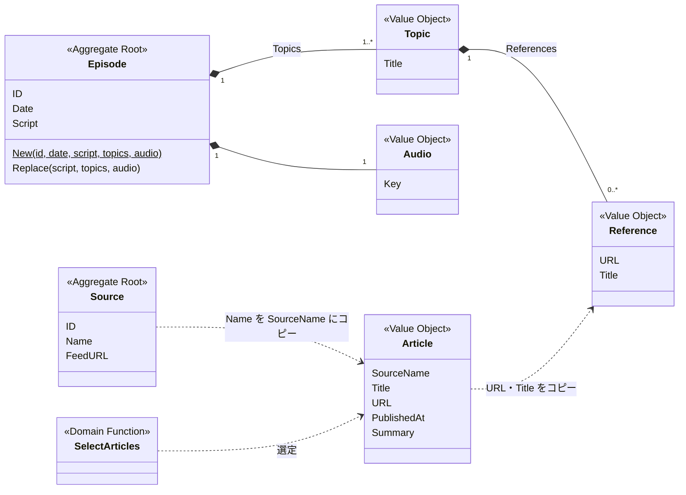
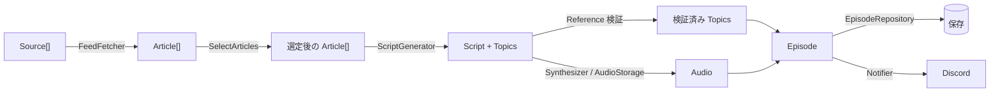

# Domain Model — MVP

このファイルは vibratio backend の Domain Model の全体像を示す。各概念の詳細と判断理由は `docs/domain-model/` 配下に分けて書いた。

- 状態: MVP の設計として合意済み（2026-10-05）。まだ決めていない項目は [§7](#7-未決事項) にまとめた
- 読み方: 初めて読むなら §1〜5 で全体をつかみ、[episode.md](domain-model/episode.md) → [article.md](domain-model/article.md) → [generate-episode.md](domain-model/generate-episode.md) の順に読む。本文中の D-xx は設計判断の補足を指す。補足は関係する節の直後に置き、一覧は [§8](#8-設計判断の一覧) にまとめた

## 1. 目的

vibratio は、技術系の情報源から毎朝1回記事を収集し、ラジオ番組形式の音声（Episode）を生成して Discord に届ける個人用システムである。

ラジオは一次情報の代わりではない。その日の技術トピックをつかみ、興味を持った記事を自分で調べに行くための**入口**である。そのため Episode は「何を話したか」と同じくらい「どの記事を紹介したか」を重視する。

## 2. 設計方針

| 方針 | 内容 |
| --- | --- |
| 低コスト | LLM には記事本文を渡さず、メタデータと概要（Summary）だけを渡す。Summary は N 文字以内、記事数は Source ごとに k 件以内とする。Title などのメタデータと Source 数には上限を設けない。抑えるのは記事1件あたりの量で、入力量全体に上限はない |
| シンプル | Entity / Aggregate / Repository は必要なものだけを置く。状態遷移は持たない |
| 外部サービスを持ち込まない | RSS / Atom、LLM、TTS、S3、DynamoDB、Discord の仕様は Adapter に閉じ込める |
| MVP と将来を分ける | 将来必要になりうるものは [future.md](domain-model/future.md) に記録し、MVP には入れない |

## 3. ユビキタス言語

| 用語 | 意味 |
| --- | --- |
| 入口 | ユーザーがその日の話題を知り、記事を自分で読みに行くきっかけ。Episode と Discord への通知が担う |
| 生成処理 | GenerateEpisode Use Case の1回の実行 |
| Source | 記事の情報源。CMS で管理するフィード |
| Article | Source から取得した記事。生成処理の中だけで使う入力であり、保存しない |
| Episode | 1日分の番組。読み上げテキスト・話題の目次・音声を持つ |
| Script | Episode 全体の読み上げテキスト。オープニング・話題間のつなぎ・エンディングも含む1つのテキスト |
| Topic | Episode で扱った話題。見出しと参照記事を持つ「番組の目次」の1項目 |
| Reference | Topic が紹介した記事へのリンク（URL, Title） |
| Audio | Episode の音声。保存先に依存しない Key で表す |
| 選定（SelectArticles） | 取得した Article から、その日の番組の素材を決めるルール |

## 4. モデル概観

- Aggregate は Source と Episode の2つ。Article と SelectArticles はどの Aggregate にも属さない。Article は生成処理の中だけで使う入力である
- 実線（◆）は Episode Aggregate 内の所有を表す。点線は値のコピーまたは関数の入力であり、オブジェクト参照ではない
- Aggregate をまたぐ参照はない。Episode は Source も Article も参照せず、紹介した記事は Reference として値をコピーして保持する

## 5. 処理の流れ

詳細は [generate-episode.md](domain-model/generate-episode.md) を参照。

## 6. ドキュメント構成

| ファイル | 内容 |
| --- | --- |
| [source.md](domain-model/source.md) | Source |
| [article.md](domain-model/article.md) | Article と記事の選定ルール |
| [episode.md](domain-model/episode.md) | Episode / Script / Topic / Reference / Audio、不変条件、再生成 |
| [generate-episode.md](domain-model/generate-episode.md) | Application Use Case、Repository、Port、LLM 出力の検証 |
| [future.md](domain-model/future.md) | MVP の範囲外とした拡張 |
| [infra-alignment.md](domain-model/infra-alignment.md) | 本設計に合わせて infra 側で必要な変更 |

## 7. 未決事項

モデルの構造には影響しないが、実装や infra の作業までに決める必要がある項目。

| 項目 | 選択肢・目安 | 決める時期 | 記載箇所 |
| --- | --- | --- | --- |
| k（Source ごとの記事数の上限） | 未定 | 実装時 | [generate-episode.md](domain-model/generate-episode.md#設定値) |
| N（Summary の最大文字数） | 300〜500 文字を目安とする | 実装時 | [generate-episode.md](domain-model/generate-episode.md#設定値) |
| 再生成した音声の配信キャッシュ | 上書き時にキャッシュを無効化する / 生成ごとに新しい Key にする | AudioStorage Adapter の実装時 | [infra-alignment.md](domain-model/infra-alignment.md) |
| Episode テーブルのキー設計 | 未定 | infra の変更時 | [infra-alignment.md](domain-model/infra-alignment.md) |
| Source の Enabled | 持たせるかどうか | CMS の実装時 | [future.md](domain-model/future.md) |

## 8. 設計判断の一覧

各判断の補足（検討した案・理由・見直す条件）は、関係する節の直後に置いた。見直す条件は、具体的なきっかけが想定できる判断にだけ書いた。

| ID | 判断 | 記載箇所 |
| --- | --- | --- |
| [D-01](domain-model/article.md#d-01) | Article は保存しない | article.md |
| [D-02](domain-model/episode.md#d-02) | Script と Topics を分離する | episode.md |
| [D-03](domain-model/generate-episode.md#d-03) | LLM 出力の検証は Use Case の責務 | generate-episode.md |
| [D-04](domain-model/article.md#d-04) | 対象期間は直近 24 時間 | article.md |
| [D-05](domain-model/article.md#d-05) | 記事の選定ルールは Domain の関数 | article.md |
| [D-06](domain-model/article.md#d-06) | PublishedAt は必須 | article.md |
| [D-07](domain-model/article.md#d-07) | Summary はプレーンテキストで N 文字以内 | article.md |
| [D-08](domain-model/article.md#d-08) | Article は SourceName を値として持つ | article.md |
| [D-09](domain-model/source.md#d-09) | Source の種類を抽象化しない | source.md |
| [D-10](domain-model/source.md#d-10) | Source はフィード形式を持たない | source.md |
| [D-11](domain-model/episode.md#d-11) | Episode の Identity は ID | episode.md |
| [D-12](domain-model/episode.md#d-12) | Audio は保存先に依存しない Key だけを持つ | episode.md |
| [D-13](domain-model/episode.md#d-13) | Episode は完成したときだけ存在する | episode.md |
| [D-14](domain-model/episode.md#d-14) | 不正な Reference は除外して続行する | episode.md |
| [D-15](domain-model/episode.md#d-15) | 再生成は同じ Use Case で上書きする | episode.md |
| [D-16](domain-model/episode.md#d-16) | 記事が0件の日は Episode を作らない | episode.md |
